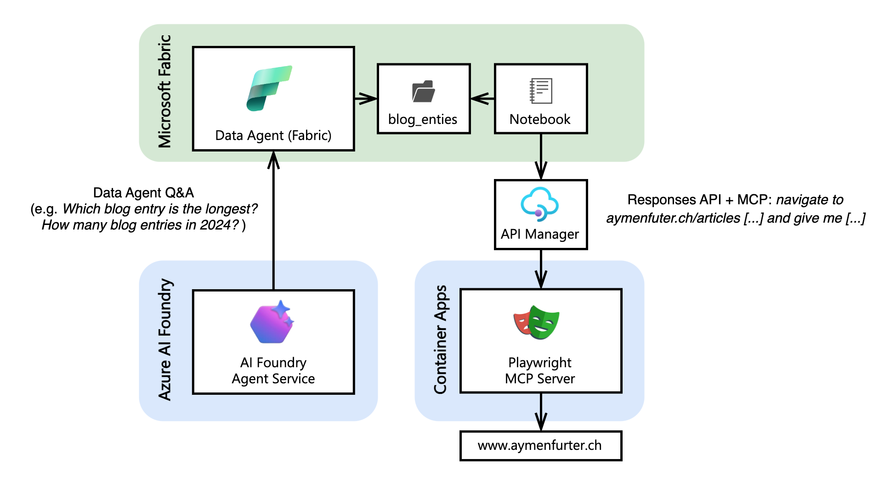
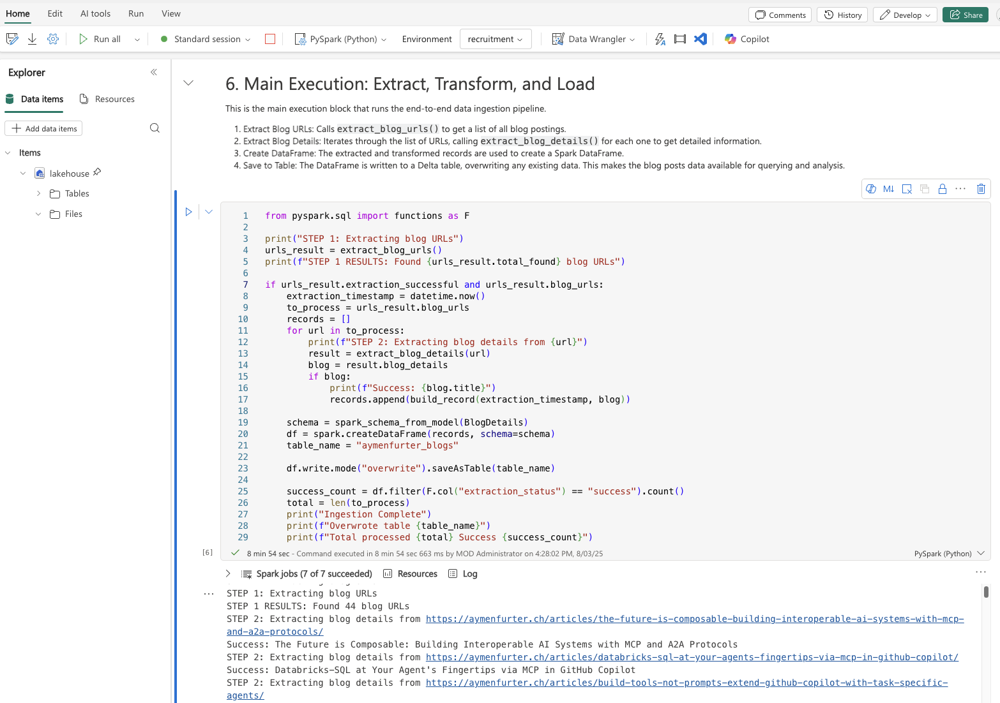
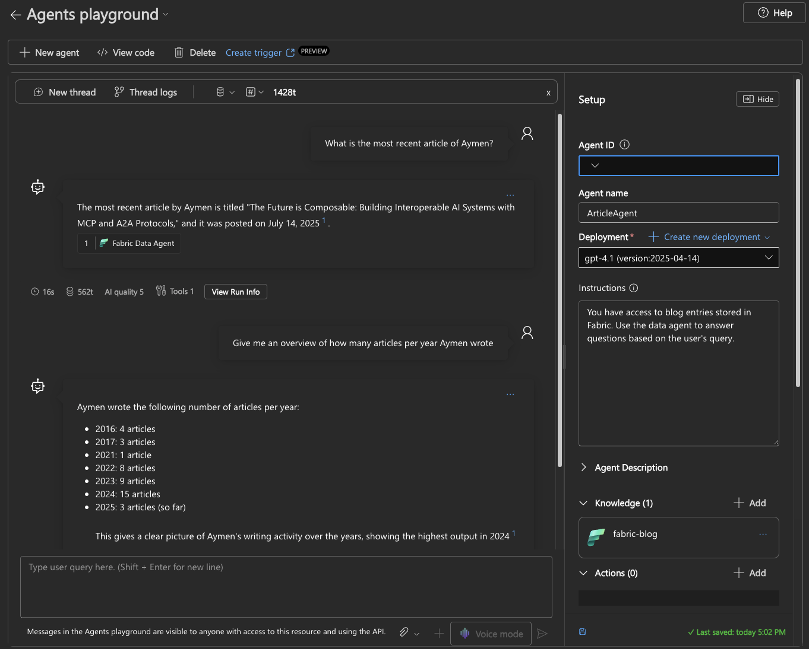

<div align="center">

> **Warning:** This is a demo. Confirm you have permission to crawl target sites and follow their terms of service.

# Agentic Web Crawler with MCP and Fabric

<p align="center">
  
  
  
  
</p>

</div>

## What it does

Extracts structured data from web content using Azure OpenAI via a Playwright MCP server, stores it in Microsoft Fabric, and lets you ask natural language questions through Azure AI Foundry with a Fabric Data Agent. There is no vector embedding search involved. SQL is generated from user language.

## Architecture

<p align="center">
  <table cellpadding="12"><tr><td align="center">
    
  </td></tr></table>
</p>

The system has two main phases plus shared infrastructure. Summary of layers:

| Phase | Core purpose |
|:------|:-------------|
| Data crawling and storage | Responses API drives Playwright MCP to fetch pages, extract and validate structured fields, persist into Fabric |
| Analytics | Fabric Data Agent turns natural language into SQL and answers via AI Foundry |
| Supporting infrastructure | API Management secures MCP, Key Vault holds secrets, Pydantic enforces schema, Fabric data warehouse holds canonical data |

## Requirements

* Azure subscription with
  * Azure OpenAI Service
  * Microsoft Fabric workspace (F2 or higher)
  * Azure Key Vault
  * Azure AI Foundry project

## Setup

1. Deploy MCP server

```bash
   cd mcp-server-deployment
   ./deploy.sh
```

2. Add secrets to Key Vault

   ```
   mcp-key: APIM subscription key
   openai-key: Azure OpenAI API key
   ```

3. Run ingestion notebook in Fabric

   * Open blog-data-ingestion.ipynb
   * Set Key Vault URI, OpenAI endpoint and deployment name, MCP server URL
   * Execute cells in order to crawl and persist data

   <p align="center">
     <table cellpadding="12"><tr><td align="center">
       
     </td></tr></table>
   </p>

4. Wire up analytics

   * Create a Fabric Data Agent and capture Workspace ID and Artifact ID from its published endpoint
   * In AI Foundry create or update an agent

     * Add Microsoft Fabric knowledge source with those IDs marked as secrets
     * Select a model such as gpt-4o-mini and enable the Fabric tool

   <p align="center">
     <table cellpadding="12"><tr><td align="center">
       
     </td></tr></table>
   </p>

## Usage

Ask questions in plain language about the ingested content. Examples

```
How many blog entries were written in 2024
What are the most recent blog posts about AI
Show me all posts that mention Azure OpenAI
Which technologies appear most often
What is the average reading duration per month
```

## References

- [Microsoft Fabric Data Agent Documentation](https://learn.microsoft.com/en-us/fabric/data-science/concept-data-agent)
- [Azure AI Foundry Fabric Tool Guide](https://learn.microsoft.com/en-us/azure/ai-foundry/agents/how-to/tools/fabric?pivots=portal)
- [Azure OpenAI Responses API Documentation](https://learn.microsoft.com/en-us/azure/ai-foundry/openai/how-to/responses?tabs=python-secure)
- [Model Context Protocol Specification](https://modelcontextprotocol.io/)
